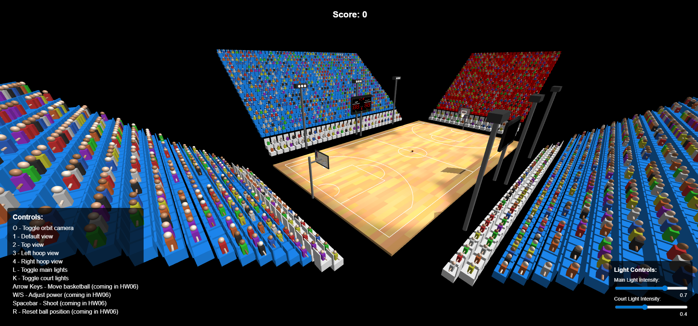
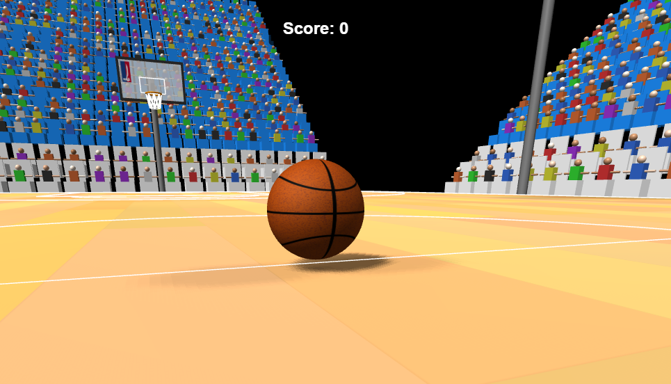
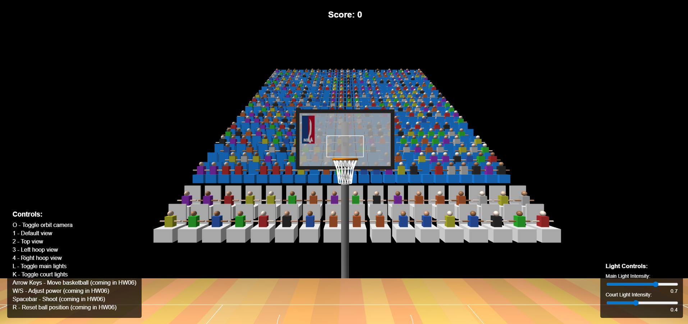
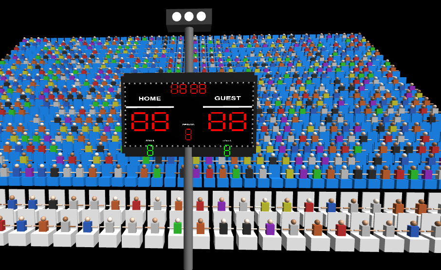
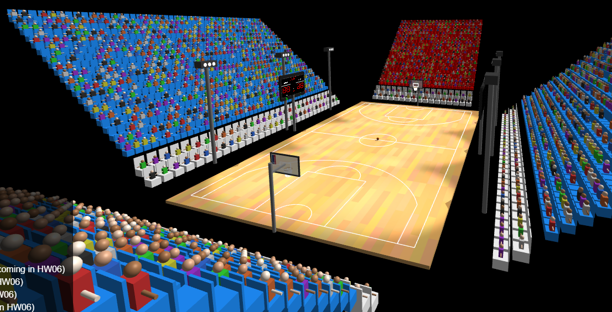
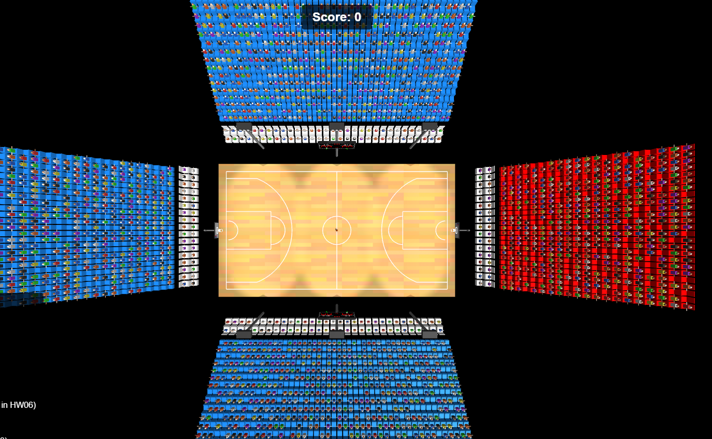

# 🏀 Interactive Basketball Game - Three.js

## Group Members
- **Ori Itzhaki**
- **Tomer Cohen**

A comprehensive 3D interactive basketball shooting game built with Three.js, featuring realistic physics, advanced game mechanics, and a complete scoring system. This project evolved from a static court visualization (HW05) into a fully playable basketball game (HW06).

## 🎮 Game Features

### 🏀 Interactive Basketball Physics
- **Realistic ball physics** with gravity simulation and trajectory calculations
- **Ball movement controls** using arrow keys with smooth animation
- **Basketball shooting mechanics** with adjustable power and angles
- **Ball rotation animations** during movement and flight
- **Bounce mechanics** with energy loss and realistic collision detection

### 🎯 Advanced Shooting System
- **Power adjustment** (W/S keys) with visual feedback
- **Vertical angle control** (Q/E keys) for shot arc
- **Automatic targeting** toward nearest hoop
- **Trajectory preview** with red dashed line visualization
- **Shot power indicator** in real-time UI

### 🏆 Comprehensive Scoring System
- **2-point and 3-point shots** based on court position
- **Swoosh detection** (bonus for shots that don't touch rim)
- **Combo system** with bonus points for consecutive shots
- **Statistics tracking**: Score, attempts, accuracy percentage
- **Real-time score updates** with animated feedback messages

### 🔊 Sound Effects & Audio
- **Crowd cheering sounds** for successful shots
- **Rhythmic cheering** for consecutive shot milestones (every 5 shots)
- **Disappointment sounds** for missed shots
- **Special "rak-reshet" sound** for swoosh shots

### 🎬 Camera & Visual System
- **Multiple camera presets**: Default, top-down, left hoop, right hoop
- **Orbit controls** for free camera movement
- **Dynamic lighting system** with adjustable intensities
- **Performance optimization** with adaptive rendering quality

### 🏟️ Detailed 3D Environment
- **NBA-standard court** (28.65m × 15.4m) with parquet flooring
- **Professional hoops** with backboards, rims, and nets
- **Court markings**: Center circle, 3-point lines, free-throw areas
- **Stadium infrastructure**: Seating, scoreboards, lighting fixtures

## 🎮 Game Controls

### Basketball Movement
- **Arrow Keys**: Move basketball around the court
- **Boundary detection**: Ball stays within court limits

### Shooting Controls
- **W/S**: Adjust shot power (0-100%)
- **Q/E**: Adjust vertical shooting angle
- **Spacebar**: Shoot basketball
- **R**: Reset ball to center court

### Camera Controls
- **O**: Toggle orbit camera controls
- **1**: Default view
- **2**: Top-down view
- **3**: Left hoop view
- **4**: Right hoop view
- **Mouse**: Rotate, pan, and zoom camera

### Lighting Controls
- **L**: Toggle main court lights
- **K**: Toggle court-side spotlights
- **UI Sliders**: Adjust light intensities (0.0 - 1.0)

## 🏗️ Technical Architecture

### Modular System Design
The project uses a sophisticated modular architecture with separate systems for different game aspects:

```
src/systems/
├── ballPhysics.js      # Physics simulation and ball movement
├── shootingSystem.js   # Shot power, angles, and trajectory
├── scoringSystem.js    # Score tracking and statistics
├── collisionSystem.js  # Rim collisions and scoring detection
├── soundSystem.js      # Audio management and playback
├── cameraSystem.js     # Camera presets and controls
└── gameManager.js      # Coordinates all systems
```

### Core Game Systems

#### 🏀 BallPhysicsSystem
- Gravity simulation (-9.8 m/s²)
- Velocity calculations and trajectory physics
- Ground collision with bounce mechanics
- Ball rotation animations
- Energy conservation and realistic physics constants

#### 🎯 ShootingSystem
- Power adjustment (6.5-13.0 m/s velocity range)
- Vertical angle control with automatic horizontal targeting
- Real-time trajectory preview visualization
- Shot parameter validation and UI updates

#### 🏆 ScoringSystem
- 2-point and 3-point shot detection
- Swoosh detection (no rim contact)
- Combo bonus system (3+ consecutive shots)
- Comprehensive statistics tracking
- Animated score feedback messages

#### 💥 CollisionSystem
- 48 rim collider spheres for realistic physics
- Circular plane intersection for scoring detection
- Continuous collision detection for fast-moving balls
- Energy loss calculations on rim contact

#### 🔊 SoundSystem
- Multiple crowd cheering sound effects
- Contextual audio (swoosh, regular shots, disappointment)
- Rhythmic milestone celebrations
- Volume control and audio management

#### 📷 CameraSystem
- 4 preset camera positions
- Smooth transitions between views
- Orbit controls integration
- Window resize handling

#### 🎮 GameManager
- Coordinates all game systems
- Manages game state and updates
- Handles the main game loop with fixed timestep physics
- Performance monitoring and optimization

## 📁 Project Structure

```
├── index.html                     # Main HTML file
├── index.js                      # Express server setup
├── package.json                  # Dependencies and scripts
├── README.md                     # This file
├── REFACTORING_SUMMARY.md        # System architecture documentation
├── CONFIGURATION.md              # Setup and configuration guide
├── entities_hirarchy_tree.md     # 3D scene hierarchy
├── screenshots/                  # Game screenshots
├── src/
│   ├── hw5.js                   # Main application entry point
│   ├── basketball.js            # Basketball mesh creation
│   ├── basketballCourt.js       # Court geometry and markings
│   ├── basketballHoops.js       # Hoops, backboards, and nets
│   ├── courtLights.js           # Stadium lighting system
│   ├── seats.js                 # Stadium seating
│   ├── scoreboard.js            # Scoreboard displays
│   ├── ui.js                    # User interface elements
│   ├── OrbitControls.js         # Camera controls
│   ├── physics-hw06/
│   │   ├── basketballMovement.js # Ball movement mechanics
│   │   └── basketball_exercise_hw06_instructions.html
│   ├── systems/                 # Modular game systems
│   │   ├── ballPhysics.js       # Physics simulation
│   │   ├── shootingSystem.js    # Shooting mechanics
│   │   ├── scoringSystem.js     # Score and statistics
│   │   ├── collisionSystem.js   # Collision detection
│   │   ├── soundSystem.js       # Audio management
│   │   ├── cameraSystem.js      # Camera controls
│   │   └── gameManager.js       # System coordination
│   ├── sounds/                  # Audio files
│   │   ├── crowd-cheering-rhythmic-cheering.mp3
│   │   ├── crowd-cheering1.mp3
│   │   ├── crowd-cheering2.mp3
│   │   ├── crowd-cheering3.mp3
│   │   ├── crowd-disappointment.mp3
│   │   ├── rak-reshet.mp3
│   │   └── sad-trombone.mp3
│   └── textures/
│       ├── basketballTexture.js  # Procedural basketball texture
│       ├── nbaLogo.js            # NBA logo generation
│       └── parquetTexture.js     # Court floor texture
```

## 🚀 Getting Started

### Prerequisites
- Node.js (v14 or higher)
- Modern web browser with WebGL support

### Installation & Setup
1. **Clone the repository**
   ```bash
   git clone [repository-url]
   cd computer-graphics-ex05-repo
   ```

2. **Install dependencies**
   ```bash
   npm install
   ```

3. **Start the server**
   ```bash
   npm start
   # or
   node index.js
   ```

4. **Open in browser**
   ```
   http://localhost:8000
   ```

## 🎯 Game Mechanics

### Scoring System
- **2 Points**: Regular shots within the 3-point line
- **3 Points**: Shots from beyond the 3-point line
- **Swoosh Bonus**: Clean shots without rim contact
- **Combo Bonuses**: Consecutive shots award additional points
  - 3rd consecutive: +1 bonus point
  - 4th consecutive: +2 bonus points
  - 5th consecutive: +3 bonus points (and so on...)

### Performance Features
- **Fixed timestep physics** (60 FPS) for consistent gameplay
- **Adaptive rendering quality** for performance optimization
- **Performance monitoring** with FPS tracking
- **Optimized collision detection** with spatial partitioning

## 🎨 Visual Features

### Screenshots

*Complete court view with UI controls*


*Detailed basketball with realistic textures*


*Professional basketball hoop from free-throw line*


*Dynamic lighting system demonstration*


*Stadium scoreboard displays*


*Side view showing stadium seating*


*Bird's eye view of the complete court*

## 🔧 Dependencies

- **Three.js**: 3D graphics library
- **Express**: Web server framework
- **Custom Systems**: 
  - OrbitControls for camera manipulation
  - Procedural texture generation
  - Modular game architecture
  - Physics simulation engine

## 🏆 Advanced Features Implemented

- ✅ **Multiple Hoops**: Automatic targeting of nearest hoop
- ✅ **Swish Detection**: Bonus points for rim-free shots
- ✅ **Combo System**: Consecutive shot bonuses
- ✅ **Sound Effects**: Comprehensive audio feedback
- ✅ **Realistic Physics**: Professional-grade collision detection
- ✅ **Performance Optimization**: Adaptive quality and monitoring
- ✅ **Advanced UI**: Real-time statistics and feedback

## 📈 Performance Optimizations

- **Fixed timestep physics** for consistent gameplay across different frame rates
- **Adaptive pixel ratio** limiting for performance on high-DPI displays
- **Selective rendering quality** adjustment during low FPS scenarios
- **Optimized collision detection** with early termination
- **Memory efficient** object pooling for temporary calculations

## 🎓 Educational Value

This project demonstrates advanced computer graphics concepts including:
- 3D scene construction and hierarchy
- Physics simulation and numerical integration
- Collision detection algorithms
- Real-time rendering optimization
- Modular software architecture
- Game loop design and timing
- Audio integration and management
- User interface design in 3D applications

## 📝 Development Notes

The project evolved through two major phases:
- **HW05**: Static 3D basketball court with lighting and camera controls
- **HW06**: Interactive game with physics, shooting mechanics, and scoring system

The codebase was significantly refactored from a monolithic structure to a modular system-based architecture, improving maintainability and extensibility.

## 🐛 Known Issues & Limitations

- High-speed ball movement may occasionally clip through collision boundaries
- Audio playback requires user interaction on some browsers due to autoplay policies
- Performance may degrade on older hardware with complex lighting enabled

## 🔮 Future Enhancements

- Multiplayer support with networked gameplay
- Advanced ball trail effects and particle systems
- Multiple game modes (time challenges, accuracy tests)
- Leaderboard system with persistent high scores
- Virtual reality (VR) support for immersive gameplay
- AI-powered shooting assistance and training modes

## Setup and Running

1. Clone the repository
2. Install dependencies:
   ```bash
   npm install
   ```
3. Start the server:
   ```bash
   node index.js
   ```
4. Open your browser to `http://localhost:8000`

